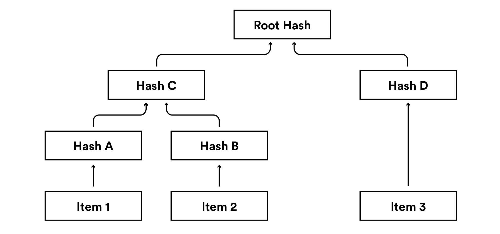
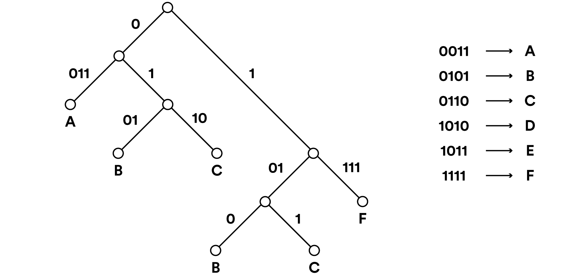

# Data Model Specification

* [Introduction](#introduction)
* [Definitions](#definitions)
  * [Varint](#varint)
  * [Varint31](#varint31)
  * [Varint63](#varint63)
  * [Varstring31](#varstring31)
  * [Extensible string](#extensible-string)
  * [Public Key](#public-key)
  * [Signature](#signature)
  * [SHA3](#sha3)
  * [Block](#block)
  * [Block Serialization Flags](#block-serialization-flags)
  * [Block Header](#block-header)
  * [Block Commitment](#block-commitment)
  * [Block Witness](#block-witness)
  * [Block ID](#block-id)
  * [Transaction](#transaction)
  * [Transaction Common Fields](#transaction-common-fields)
  * [Transaction Common Witness](#transaction-common-witness)
  * [Transaction Input](#transaction-input)
  * [Transaction Input Commitment](#transaction-input-commitment)
  * [Issuance Hash](#issuance-hash)
  * [Transaction Input Witness](#transaction-input-witness)
  * [Output ID](#output-id)
  * [Transaction Output](#transaction-output)
  * [Transaction Output Commitment](#transaction-output-commitment)
  * [Transaction Output Witness](#transaction-output-witness)
  * [Transaction Serialization Flags](#transaction-serialization-flags)
  * [Transaction ID](#transaction-id)
  * [Transaction Wire Serialization](#wire-format-serialization)
      * [Transaction Common Fields](#transaction-common-fields)
      * [Transaction Common Witness](#transaction-common-witness)
      * [Transaction Input](#transaction-input)
      * [Transaction Input Commitment](#transaction-input-commitment)
      * [Issuance Hash](#issuance-hash)
      * [Transaction Input Witness](#transaction-input-witness)
      * [Output ID](#output-id)
      * [Transaction Output](#transaction-output)
      * [Transaction Output Commitment](#transaction-output-commitment)
      * [Transaction Output Witness](#transaction-output-witness)
      * [Transaction Serialization Flags](#transaction-serialization-flags)
      * [Transaction ID](#transaction-id)
  * [Program](#program)
  * [VM Version](#vm-version)
  * [Consensus Program](#consensus-program)
  * [Control Program](#control-program)
  * [Issuance Program](#issuance-program)
  * [Program Arguments](#program-arguments)
  * [Asset Version](#asset-version)
  * [Asset ID](#asset-id)
  * [Asset Definition](#asset-definition)
  * [Retired Asset](#retired-asset)
  * [Transactions Merkle Root](#transactions-merkle-root)
  * [Assets Merkle Root](#assets-merkle-root)
  * [Merkle Root](#merkle-root)
  * [Merkle Binary Tree](#merkle-binary-tree)
  * [Merkle Patricia Tree](#merkle-patricia-tree)
* [References](#references)

## Introduction

This document describes the blockchain data structures used in the Chain Protocol.

## Definitions

### Varint

[Little Endian Base 128](https://developers.google.com/protocol-buffers/docs/encoding) encoding for unsigned integers typically used to specify length prefixes for arrays and strings. Values in range [0, 127] are encoded in one byte. Larger values use two or more bytes.

### Varint31

A varint with a maximum allowed value of 0x7fffffff (231 – 1) and a minimum of 0. A varint31 fits into a signed 32-bit integer.

### Varint63

A varint with a maximum allowed value of 0x7fffffffffffffff (263 – 1) and a minimum of 0. A varint63 fits into a signed 64-bit integer.

### Varstring31

A binary string with a varint31 prefix specifying its length in bytes. So the empty string is encoded as a single byte 0x00, a one-byte string is encoded with two bytes 0x01 0xNN, a two-byte string is 0x02 0xNN 0xMM, etc. The maximum allowed length of the underlying string is 0x7fffffff (231 – 1).

### Extensible string

A varstring31 whose content is the concatenation of other encoded data structures, possibly including other varstring31s. Used for values that future versions of the protocol might wish to extend without breaking older clients. Older clients can consume the complete “outer” varstring31 and parse out the subparts they understand while ignoring the suffix that they don’t.

### Public Key

In this document, a *public key* is the 32-byte binary encoding
of an Ed25519 (EdDSA) public key, as defined in [CFRG1](https://tools.ietf.org/html/draft-irtf-cfrg-eddsa-05).

### Signature

In this document, a *signature* is the 64-byte binary encoding
of an Ed25519 (EdDSA) signature, as defined in [CFRG1](https://tools.ietf.org/html/draft-irtf-cfrg-eddsa-05).

### SHA3

*SHA3* refers to the SHA3-256 function as defined in [FIPS202](https://dx.doi.org/10.6028/NIST.FIPS.202) with a fixed-length 32-byte output.

This hash function is used throughout all data structures and algorithms in this spec,
with the exception of SHA-512 (see [FIPS180](http://csrc.nist.gov/publications/fips/fips180-2/fips180-2withchangenotice.pdf)) used internally as function H inside Ed25519 (see [CFRG1](https://tools.ietf.org/html/draft-irtf-cfrg-eddsa-05)).

### Block

Field               | Type              | Description
--------------------|-------------------|----------------------------------------------------------
Serialization Flags | byte              | See [Block Serialization Flags](#block-serialization-flags).
Version             | varint63          | Block version, equals 1.
Height              | varint63          | Block serial number.
Previous Block ID   | sha3-256          | [Hash](#block-id) of the previous block or all-zero string.
Timestamp           | varint63          | Time of the block in milliseconds since 00:00:00 UTC Jan 1, 1970.
Block Commitment    | Extensible string | Extensible commitment string. See [Block Commitment](#block-commitment).
Block Witness       | Extensible string | Extensible witness string. See [Block Witness](#block-witness).
Transaction Count   | varint31          | Number of transactions that follow.
Transactions        | [Transaction]     | List of individual [transactions](#transaction).

### Block Serialization Flags

Serialization flags control what data is in a given block message and how it is encoded. Unused values are reserved for future expansion. Implementations must reject messages using unsupported serialization values.

The **first (least significant) bit** indicates whether the block includes [witness](#block-witness) data. If this bit is zero, the witness data is omitted entirely.

The **second bit** indicates whether the block includes [transaction](#transaction) data. If this bit is zero, the transaction count and transactions are omitted entirely.

Non-zero **higher bits** and value 0x02 are reserved for future use.

Serialization Flags Examples | Description
-----------------------------|---------------------------
0000 0000                    | Block with neither witness nor transactions. Used in [block ID](#block-id).
0000 0001                    | Block with witness but without transactions. Also called a “[block header](#block-header)”.
0000 0011                    | Block with both witness and transactions. Also called simply a “[block](#block)”.
0000 0010                    | Reserved for future use.

### Block Header

“Block header” is shorthand for a block serialized with [serialization flags](#block-serialization-flags) 0x01. Header does not contain actual transactions, but contains all commitments and witness data with block signatures.

### Block Commitment

The *block commitment* string allows extending blocks with additional data. For instance, a hypothetical future [VM version](#vm-version) might append a hash of an additional state available to the programming environment.

Unknown appended commitments must be ignored. Changes to the format of the commitment string may only append new fields, never remove or change the semantics of the existing ones.

Field                                   | Type        | Description
----------------------------------------|-------------|----------------------------------------------------------
Transactions Merkle Root                | sha3-256    | Root hash of the [merkle binary hash tree](#merkle-binary-tree) formed by the transaction IDs of all transactions included in the block.
Assets Merkle Root                      | sha3-256    | Root hash of the [merkle patricia tree](#merkle-patricia-tree) of the set of unspent outputs with asset version 1 after applying the block. See [Assets Merkle Root](#assets-merkle-root) for details.
Next [Consensus Program](#consensus-program) | varstring31 | Authentication predicate for adding a new block after this one.
—                                       | —           | Additional fields may be added by future extensions.

### Block Witness

The *block witness* string contains cryptographic signatures and other data necessary for block verification. It allows extending blocks with additional witness data in future upgrades excluded from any signatures on this block, but committed to by the blocks that follow.

Witness Field           | Type          | Description
------------------------|---------------|----------------------------------------------------------
Program Arguments Count | varint31      | Number of [program arguments](#program-arguments) that follow.
Program Arguments       | [varstring31] | List of [signatures](#signature) and other data satisfying previous block’s [next consensus program](#consensus-program).
—                       | —             | Additional fields may be added by future extensions.

The entire witness data string (including any unsupported fields) is excluded from the [block’s ID](#block-id).

### Block ID

The *block ID* (also called *block hash*) is defined as [SHA3-256](#sha3) of the block serialized with 0x00 [serialization flags](#block-serialization-flags). This covers header data excluding the block witness, but including the [transactions’ merkle root](#transactions-merkle-root).

### Transaction

In Chain Protocol 1, transactions can be represented and serialized in two different ways.

When transactions are going to be transmitted over the wire, they are serialized using [Wire Format Serialization](#wire-format-serialization), which creates a serialized transaction composed of types described above. 

Conversely, when transactions are hashed, they are serialized using [Serialization for Hashing](#serialization-for-hashing), which generates a deterministic hash value that is independent of the wire format serialization. 

#### Wire Format Serialization

When serialized for the wire, a *transaction* comprises the following fields concatenated:

Field               | Type          | Description
--------------------|---------------|----------------------------------------------------------
Serialization Flags | byte          | See [transaction serialization flags](#transaction-serialization-flags).
Version             | varint63      | Transaction version, equals 1.
Common Fields       | [Extensible string](#extensible-string) | A [common fields varstring31](#transaction-common-fields).
Common Witness      | [Extensible string](#extensible-string) | A [common witness varstring31](#transaction-common-witness).
Inputs Count        | varint31      | Number of transaction inputs that follow.
Inputs              | [TxInput]     | List of [transaction inputs](#transaction-input).
Outputs Count       | varint31      | Number of transaction outputs that follow.
Outputs             | [TxOutput]    | List of [transaction outputs](#transaction-output).
Reference Data      | varstring31   | Arbitrary string or its [optional hash](#optional-hash), depending on [serialization flags](#transaction-serialization-flags).

#### Transaction Common Fields

This is the extensible set of fields common to all inputs and outputs.

Field               | Type          | Description
--------------------|---------------|----------------------------------------------------------
Minimum Time        | varint63      | Zero or a block timestamp at which transaction becomes valid.
Maximum Time        | varint63      | Zero or a block timestamp after which transaction becomes invalid.
—                   | —             | Additional fields may be added by future extensions.

#### Transaction Common Witness

The *transaction common witness* string contains data necessary to verify the entire transaction, but not specific to any particular input or output. Witness string does not affect the *outcome* of the transaction and therefore is excluded from the [transaction ID](#transaction-id).

Present version of the protocol does not define any fields in the common witness.

Field               | Type        | Description
--------------------|-------------|----------------------------------------------------------
—                   | —           | Additional fields may be added by future extensions.

#### Transaction Input

A *transaction input* specifies an asset being issued or an earlier output being spent by the transaction. For extensibility, the concrete mechanism for issuance and spending is specific to each asset version, which is specified in the beginning of the input.

The [asset version](#asset-version) defines the encoding and semantics of the *input commitment* and *witness* strings that follow. Nodes must ignore spend commitment and witness data if the asset version is unknown. This enables soft fork upgrades to new accounting mechanisms, and leaves individual fields readable by older nodes.

Field             | Type                | Description
------------------|---------------------|----------------------------------------------------------
Asset Version     | varint63            | Version of the asset being referenced by this input.
Input Commitment  | Extensible string   | See [Transaction Input Commitment](#transaction-input-commitment).
Reference Data    | varstring31         | Arbitrary string or its [optional hash](#optional-hash), depending on [serialization flags](#transaction-serialization-flags).
Input Witness     | Extensible string   | Optional [input witness](#transaction-input-witness) data. Absent if [serialization flags](#transaction-serialization-flags) do not have the witness bit set.

#### Transaction Input Commitment

**Asset Version 1** defines two types of input commitments. The type is specified by a single-byte prefix.

1. **Issuance Commitment:** (type 0x00) introduces new units of an asset defined by its issuance program.
2. **Spend Commitment:** (type 0x01) references already existing value stored in an unspent output.

Nodes must reject transactions with unknown type values for asset version 1.

An asset version other than 1 is reserved for future expansion. Input commitments for undefined versions must be ignored.

##### Asset Version 1 Issuance Commitment

Unlike spending commitments, each of which is unique because it references a distinct [output ID](#output-id), issuance commitments are not intrinsically unique and must be made so to protect against replay attacks. The field *nonce* contains an arbitrary string that must be distinct from the nonces in other issuances of the same asset ID during the interval between the transaction's minimum and maximum time. Nodes ensure uniqueness of the issuance by remembering the [issuance hash](#issuance-hash) that includes the nonce, asset ID and minimum and maximum timestamps. To make sure that *issuance memory* does not take an unbounded amount of RAM, network enforces the *maximum issuance window* for these timestamps.

If the transaction has another input that guarantees uniqueness of the entire transaction (e.g. a [spend input](#asset-version-1-spend-commitment)), then the issuance input must be able to opt out of the bounded minimum and maximum timestamps and therefore the uniqueness test for the [issuance hash](#issuance-hash). The empty nonce signals if the input opts out of the uniqueness checks.

See [Validate Transaction](validation.md#validate-transaction) section for more details on how the network enforces the uniqueness of issuance inputs.

Field                 | Type                | Description
----------------------|---------------------|----------------------------------------------------------
Type                  | byte                | Equals 0x00 indicating the “issuance” type.
Nonce                 | varstring31         | Variable-length string guaranteeing uniqueness of the issuing transaction or of the given issuance.
Asset ID              | sha3-256            | Global [asset identifier](#asset-id).
Amount                | varint63            | Amount being issued.
—                     | —                   | Additional fields may be added by future extensions.

##### Asset Version 1 Spend Commitment

Field                 | Type                  | Description
----------------------|-----------------------|----------------------------------------------------------
Type                  | byte                  | Equals 0x01 indicating the “spend” type.
Output ID             | sha3-256              | [Output ID](#output-id) that references an output being spent.
Output Commitment     | [Output Commitment](#transaction-output-commitment) | Output commitment used as the source for this input or its [SHA3-256](#sha3) hash, depending on [serialization flags](#transaction-serialization-flags).
—                     | —                     | Additional fields may be added by future extensions.

#### Issuance Hash

Issuance hash provides a globally unique identifier for an issuance input. It is defined as [SHA3-256](#sha3) of the following structure:

Field                   | Type                    | Description
------------------------|-------------------------|----------------------------------------------------------
Nonce                   | varstring31             | Nonce from the [issuance commitment](#asset-version-1-issuance-commitment).
Asset ID                | sha3-256                | Global [asset identifier](#asset-id).
Minimum Time            | varint63                | Minimum time from the [common fields](#transaction-common-fields).
Maximum Time            | varint63                | Maximum time from the [common fields](#transaction-common-fields).

Note: the timestamp values are used exactly as specified in the [transaction](#transaction-common-fields).

#### Transaction Input Witness

The *transaction input witness* string contains [program arguments](#program-arguments) ([cryptographic signatures](#signature) and other data necessary to verify the input). Witness string does not affect the *outcome* of the transaction and therefore is excluded from the [transaction ID](#transaction-id).

The input witness string can be extended with additional commitments, proofs or validation hints that are excluded from the [transaction ID](#transaction-id).

Asset version 1 defines two witness structures: one for issuances and another one for spends.

##### Asset Version 1 Issuance Witness

Field                   | Type                    | Description
------------------------|-------------------------|----------------------------------------------------------
Initial Block ID        | sha3-256                | Hash of the first block in this blockchain.
Asset Definition        | varstring31             | Arbitrary string or its [optional hash](#optional-hash), depending on [serialization flags](#transaction-serialization-flags).
VM Version              | varint63                | [Version of the VM](#vm-version) that executes the issuance program.
Issuance Program        | varstring31             | Predicate defining the conditions of issue.
Program Arguments Count | varint31                | Number of [program arguments](#program-arguments) that follow.
Program Arguments       | [varstring31]           | [Signatures](#signature) and other data satisfying the spent output’s predicate. Used to initialize the [data stack](vm1.md#vm-state) of the VM that executes an issuance or an control program.
—                       | —                       | Additional fields may be added by future extensions.

Note: nodes must verify that the initial block ID and issuance program are valid and match the declared asset ID in the [issuance commitment](#asset-version-1-issuance-commitment).

##### Asset Version 1 Spend Witness

Field                   | Type                    | Description
------------------------|-------------------------|----------------------------------------------------------
Program Arguments Count | varint31                | Number of [program arguments](#program-arguments) that follow.
Program Arguments       | [varstring31]           | [Signatures](#signature) and other data satisfying the spent output’s predicate. Used to initialize the [data stack](vm1.md#vm-state) of the VM that executes an issuance or an control program.
—                       | —                       | Additional fields may be added by future extensions.

#### Output ID

An *output ID* uniquely identifies a single transaction output. It is defined as SHA3-256 hash of the following structure:

Field                   | Type                    | Description
------------------------|-------------------------|----------------------------------------------------------
Transaction ID          | sha3-256                | [Transaction ID](#transaction-id) of the referenced transaction.
Output Index            | varint31                | Index (zero-based) of the [output](#transaction-output) within the transaction.

#### Transaction Output

A *transaction output* specifies an asset version, an output commitment, and reference data.

Asset version defines encoding and semantics of the output commitment string that follows. Nodes must ignore the output commitment if the asset version is unknown. This allows soft fork upgrades to new accounting mechanisms, and leaves the reference data field readable by older nodes.

Field               | Type                    | Description
--------------------|-------------------------|----------------------------------------------------------
Asset Version       | varint63                | [Version of the asset](#asset-version) being committed to this output.
Output Commitment   | Extensible string       | Transaction [output commitment](#transaction-output-commitment) string.
Reference Data      | varstring31             | Arbitrary string or its optional hash, depending on [serialization flags](#transaction-serialization-flags).
Output Witness      | Extensible string       | Arbitrary string containing proofs related to the [output commitment](#transaction-output-commitment). Absent if [serialization flags](#transaction-serialization-flags) do not have the witness bit set.

#### Transaction Output Commitment

The *output commitment* encapsulates both the value and the authentication data necessary to spend that value.

##### Asset Version 1 Output Commitment

Field           | Type                    | Description
----------------|-------------------------|----------------------------------------------------------
Asset ID        | sha3-256                | Global [asset identifier](#asset-id).
Amount          | varint63                | Number of units of the specified asset.
VM Version      | varint63                | [Version of the VM](#vm-version) that executes the [control program](#control-program).
Control Program | varstring31             | Predicate [program](#control-program) to control the specified amount.
—               | —                       | Additional fields may be added by future extensions.

#### Transaction Output Witness

Like the input witness data, the *output witness* string contains data necessary for transaction verification, but which does not affect the *outcome* of the transaction and therefore is excluded from the [transaction ID](#transaction-id).

The output witness string can be extended with additional commitments, proofs or validation hints that are excluded from the [transaction ID](#transaction-id).

**Asset version 1** and **VM version 1** do not use the output witness data which is set to an empty string (encoded as a single byte 0x00 that represents a varstring31 encoding of an empty string). To support future upgrades, nodes must accept and ignore arbitrary data in the output witness string.

#### Transaction ID

The *transaction ID* (also called *txid* or *transaction hash*) is defined as [SHA3-256](#sha3) of the transaction serialized with 0x00 [serialization flags](#transaction-serialization-flags). Thus, reference data is hashed via intermediate hashes and transaction witness data is excluded.

### Transaction Serialization for Hashing

Serialization is defined using the serialization primitives [Byte](#byte), [Hash](#hash), [Integer](#integer), [String](#string), [List](#list) and [Struct](#struct). 

When hashing, a transaction is composed of a set of Transaction Entries, all of which inherit from the common type [Abstract Entry](#abstract-entry). 

Entries are used to define transactions. For example, they are used to specify inputs or outputs and add reference data. Each Transaction must include a [Header Entry](#header-entry). Entries can be identified by their [Entry ID](#entry-id). 

Older nodes may come across Entries with a type that they don't recognize. All unrecognized Entries should be treated as [Unknown Entries](#unknown-entry).

Field               | Type                 | Description
--------------------|----------------------|----------------------------------------------------------
Header              | Header               | A Header entry.
Entries             | List<AbstractEntry>  | A list of TransactionEntries. 

### Program

A variable-length string of instructions executed by a virtual machine during blockchain verification.

### VM Version

A variable-length integer encoded as [varint63](#varint63) that defines bytecode format and virtual machine semantics for a program. See [VM Versioning](vm1.md#versioning) for more details.

### Consensus Program

The consensus program is a program declared in the [block commitment](#block-commitment) specifying a predicate for signing the next block after the current one.

### Control Program

The control program is a program specifying a predicate for transferring an asset; this is the asset’s destination. Control programs usually contain a hash of a contract allowing the actual contract code to be supplied later in the program arguments list of a spending transaction (along with authentication data such as digital signatures).

### Issuance Program

The issuance program is a [program](#program) specifying a predicate for issuing an asset within an [input issuance commitment](#asset-version-1-issuance-commitment). The asset ID is derived from the issuance program, guaranteeing the authenticity of the issuer.

### Program Arguments

A list of binary strings in a [transaction input witness](#transaction-input-witness) and [block witness](#block-witness) structures. It typically contains signatures and other data to satisfy the predicate specified by the control program of the output referenced by the current input. Program arguments are used also for authenticating *issuance inputs* where the predicate is defined by an issuance program.

### Asset Version

An *asset version* is a variable-length integer encoded as [varint63](#varint63). Asset issuance and transfer is defined within the scope of a given asset version. Commitments and witness fields of inputs and outputs with unknown versions are treated as opaque strings. Unassigned versions are left for future extensions.

### Asset ID

Globally unique identifier of a given asset. Each [asset version](#asset-version) defines its own method to compute the asset ID, but an asset ID is always guaranteed to be unique across all asset versions and across all blockchains.

Asset ID is defined as the [SHA3-256](#sha3) of the following structure:

Field                 | Type          | Description
----------------------|---------------|-------------------------------------------------
Initial Block ID      | sha3-256      | Hash of the first block in this blockchain.
VM Version            | varint63      | [Version of the VM](#vm-version) for the issuance program.
Issuance Program      | varstring31   | Program used in the issuance input.
Asset Definition Hash | sha3-256      | [SHA3-256](#sha3) hash of the asset definition data.

### Asset Definition

An asset definition is an arbitrary binary string that corresponds to a particular [asset ID](#asset-id). Each asset version may define its own method to declare and commit to asset definitions.

### Retired Asset

Units of an asset can be retired by sending them to a [VM version 1](#vm-version) [control program](#control-program) starting with [FAIL](vm1.md#fail) instruction resulting in a provably unspendable output. The rest of the control program can contain arbitrary instructions.

Retired assets are not included in the [assets merkle root](#assets-merkle-root) and therefore do not occupy any memory in the nodes. One may use a merkle path to the [transactions merkle root](#transactions-merkle-root) to create a compact proof for a retired asset.

Note: many other kinds of control programs may render the output unspendable (e.g. `FALSE` or `0 VERIFY`), but they do not cause the output to be removed from the [assets merkle root](#assets-merkle-root), only programs beginning with `FAIL` do.

### Transactions Merkle Root

Root hash of the [merkle binary hash tree](#merkle-binary-tree) formed by the [transaction IDs](#transaction-id) of all transactions included in the block.

### Assets Merkle Root

Root hash of the [merkle patricia tree](#merkle-patricia-tree) formed by unspent outputs with an **asset version 1** after applying the block. Allows bootstrapping nodes from recent blocks and an archived copy of the corresponding merkle patricia tree without processing all historical transactions.

The tree contains the list of the [Output IDs](#output-id) of all [non-retired](#retired-asset) unspent outputs.

### Merkle Root

A top hash of a *merkle tree* (binary or patricia). Merkle roots are used within blocks to commit to a set of transactions and complete state of the blockchain. They are also used in merkleized programs and may also be used for structured reference data commitments.

### Merkle Binary Tree

The protocol uses a binary merkle hash tree for efficient proofs of validity. The construction is from [RFC 6962 Section 2.1](https://tools.ietf.org/html/rfc6962#section-2.1), but using SHA3–256 instead of SHA2–256. It is reproduced here, edited to update the hashing algorithm.

The input to the *merkle binary tree hash* (MBTH) is a list of data entries; these entries will be hashed to form the leaves of the merkle hash tree. The output is a single 32-byte hash value. Given an ordered list of n inputs, `D[n] = {d(0), d(1), ..., d(n-1)}`, the MBTH is thus defined as follows:

The hash of an empty list is the hash of an empty string:

    MBTH({}) = SHA3-256("")

The hash of a list with one entry (also known as a leaf hash) is:

    MBTH({d(0)}) = SHA3-256(0x00 || d(0))

For n > 1, let k be the largest power of two smaller than n (i.e., k < n ≤ 2k). The merkle binary tree hash of an n-element list `D[n]` is then defined recursively as

    MBTH(D[n]) = SHA3-256(0x01 || MBTH(D[0:k]) || MBTH(D[k:n]))

where `||` is concatenation and `D[k1:k2]` denotes the list `{d(k1), d(k1+1),..., d(k2-1)}` of length `(k2 - k1)`. (Note that the hash calculations for leaves and nodes differ. This domain separation is required to give second preimage resistance.)

Note that we do not require the length of the input list to be a power of two. The resulting merkle binary tree may thus not be balanced; however, its shape is uniquely determined by the number of leaves.

### Merkle Patricia Tree

The protocol uses a binary radix tree with variable-length branches to implement a *merkle patricia tree*. This tree structure is used for efficient concurrent updates of the [assets merkle root](#assets-merkle-root) and compact recency proofs for unspent outputs.

The input to the *merkle patricia tree hash* (MPTH) is a list of data entries; these entries will be hashed to form the leaves of the merkle hash tree. The output is a single 32-byte hash value. The input list must be prefix-free; that is, no element can be a prefix of any other. Given a sorted list of n unique inputs, `D[n] = {d(0), d(1), ..., d(n-1)}`, the MPTH is thus defined as follows:

The hash of an empty list is a 32-byte all-zero string:

    MPTH({}) = 0x0000000000000000000000000000000000000000000000000000000000000000

The hash of a list with one entry (also known as a leaf hash) is:

    MPTH({d(0)}) = SHA3-256(0x00 || d(0))

For n > 1, let the bit string p be the longest common prefix of all items in `D[n]`, and let k be the number of items that have a prefix `p||0` (that is, p concatenated with the single bit 0). The merkle patricia tree hash of an n-element list `D[n]` is then defined recursively as:

    MPTH(D[n]) = SHA3-256(0x01 || MPTH(D[0:k]) || MPTH(D[k:n]))

where `||` is concatenation and `D[k1:k2]` denotes the list `{d(k1), d(k1+1),..., d(k2-1)}` of length `(k2 - k1)`. (Note that the hash calculations for leaves and nodes differ. This domain separation is required to give second preimage resistance.)

Note that the resulting merkle patricia tree may not be balanced; however, its shape is uniquely determined by the input data.

## References

* [FIPS180] [“Secure Hash Standard”, United States of America, National Institute of Standards and Technology, Federal Information Processing Standard (FIPS) 180-2](http://csrc.nist.gov/publications/fips/fips180-2/fips180-2withchangenotice.pdf).
* [FIPS202] [Federal Inf. Process. Stds. (NIST FIPS) - 202 (SHA3)](https://dx.doi.org/10.6028/NIST.FIPS.202)
* [LEB128] [Little-Endian Base-128 Encoding](https://developers.google.com/protocol-buffers/docs/encoding)
* [CFRG1] [Edwards-curve Digital Signature Algorithm (EdDSA) draft-irtf-cfrg-eddsa-05](https://tools.ietf.org/html/draft-irtf-cfrg-eddsa-05)
* [RFC 6962](https://tools.ietf.org/html/rfc6962#section-2.1)

