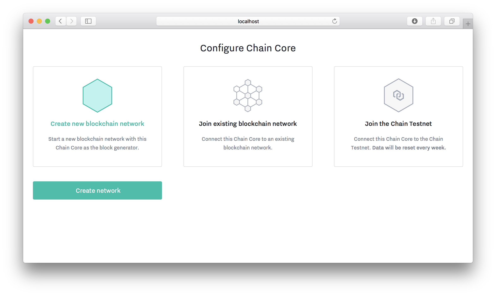

<!---
This tutorial shows you how to use the Ivy Playground, a new feature of Chain Core that lets you explore Ivy, Chain’s high-level contract language.
-->

# Ivy Playground Tutorial

This tutorial shows you how to use the Ivy Playground, a new feature of Chain Core that lets you explore Ivy, Chain’s high-level contract language. For fuller details on the syntax and semantics of Ivy, see [the Ivy documentation](docs). **This is an early preview of Ivy provided for experimentation only. Not for production use.**

## Introduction

What is a blockchain contract?

You may already know that when Alice sends a payment to Bob using Chain Core, she “locks” the payment using Bob’s public key, and Bob (and only Bob) can “unlock” the payment in a later transaction by signing with the matching private key.

This lets every Chain Core node in the network answer the question, “Is this a valid spend of the payment Alice made?” They compare the digital signature in Bob’s transaction with the public key in Alice’s. If they match, it’s valid. If they don’t, it’s not.

But this is just one application of what is actually a much more general mechanism. Nodes in the network don’t ask “Does this signature match that public key?” Instead, they ask, “Does the _program_ in Alice’s transaction produce a true result when run with the _data_ in Bob’s?” Matching a signature against a public key is just one such program, but many others are possible.

The features and examples in the Ivy Playground demonstrate the kinds of things Ivy contracts can do.

## Before you get started

You’ll need to download and run a version of Chain Core Developer Edition that includes the experimental Ivy Playground feature.

<a href="../ivy-playground/install" class="downloadBtn btn success">Install Chain Core with Ivy</a>

## Setting up

Open the Chain Core dashboard by visiting [http://localhost:1999/](http://localhost:1999/).

Select “Create new blockchain network” and click the “Create network” button.



Chain Core will ask if you’d like to try a 5-minute tutorial. This is not related to Ivy, but if you’re new to Chain Core, give it a try. It teaches concepts that will be useful in understanding Ivy. If you already have some familiarity with Chain Core, or you’re in a hurry, feel free to skip it.


Click “Ivy Playground” in the left-hand navigation bar.


## Welcome to the playground

The Ivy Playground opens on a view of the _contract template editor_, preloaded with the `LockWithPublicKey` example.


`LockWithPublicKey` is an Ivy contract that performs the simple payment function described in the Introduction above: it is used to “lock” a payment, here called `value`, with a `PublicKey` supplied by the sender of the payment. A later transaction may `unlock` the `value` by supplying a `Signature` that passes the `checkTxSig` test. (That’s short for “check transaction signature.”)

You may edit the text of the contract, but first let’s look around at the other elements on the page.

Beneath the contract editor is a box labeled “Compiled.” It shows the _opcodes_ that Chain Core uses as a compact internal representation of the contract. (This is explained in [the Appendix](#appendix-contracts-programs-accounts-receivers-and-keys).)

Above the contract editor are two buttons labeled “Load Template” and “Save.” The Save button lets you save contracts you create using the contract template editor. The Load Template button lets you load contracts you’ve previously saved, plus some prewritten samples we’ve provided, such as `LockWithPublicKey`.

Beneath the contract editor and “Compiled” box are two boxes, labeled “Value to Lock” and “Contract Arguments.” These are for using the selected contract to create a transaction that locks up actual value. We’ll return to this in a moment.

## Loading, editing, and saving contract templates

Click the “Load Template” button to get a list of available contracts. When you load a new one, the text of the contract template appears in the editor. Note how the “Compiled,” “Value to Lock,” and “Contract Arguments” sections also change.

Let’s experiment with editing a contract. But first, let’s talk a bit about the Ivy language.

### A bit about the Ivy language

A contract in Ivy always begins with the keyword `contract` followed by the contract’s name, the contract’s _parameters_, the keyword `locks`, and a name for the value controlled by the contract.

After this introduction comes one or more _clauses_. Each clause describes one possible way to unlock the value in the contract, and the data and/or payments needed to do so. In `LockWithPublicKey`, there is only one way to unlock the value: by providing a valid signature. But take a look at the `TradeOffer` contract (using the Load Template button). This contract locks up a piece of value called `offered` and there are two ways to unlock it:

- in `trade`, anyone who supplies the correct `payment` to the seller unlocks the value in `offered`
- in `cancel`, the seller supplies his or her signature to reclaim the value in `offered`

Let’s take a look at the steps involved in using something like the `TradeOffer` contract. One transaction uses it to lock up some value:

- Alice has 100 euros and wants 110 US dollars
- She creates a program by setting the parameters of `TradeOffer` as follows:
  - `requestedAsset` is `USD` (US dollars)
  - `requestedAmount` is 110
  - `sellerProgram` is the program where Alice can receive payment (payments and other transfers of value are always made “to” programs; see [the Appendix](#appendix-contracts-programs-accounts-receivers-and-keys) for a discussion)
  - `sellerKey` is Alice’s public key
- Alice creates a transaction paying 100 euros from her account into the `TradeOffer` program she just created

A later transaction unlocks the value:

- Bob, who has dollars and wants euros, sees Alice’s transaction and creates a new one with two inputs and two outputs:
  - One input is Alice’s 100 euros, unlocked with the `trade` clause
  - One input is 110 dollars from Bob’s account
  - One output sends the 110 dollars to Alice’s `sellerProgram`
  - One output sends the 100 euros to Bob’s account

Or, alternatively, if Bob never comes along and Alice wants to withdraw her offer:

- Alice creates her own second transaction with:
  - One input that unlocks the 100 euros in the `TradeOffer` contract by supplying a signature matching the `sellerKey` specified earlier
  - One output paying those 100 euros back to Alice’s account

_Contract_ parameters (including the locked value) are specified as part of the earlier transaction. _Clause_ parameters (including any required payments) are specified as part of the later transaction.

### Loading, editing, and saving contract templates, continued

Using the Load Template button, load the `LockWithPublicKey` contract template. Let’s see what happens when we make different kinds of changes. **Note:** At any point, if you can’t find your way back from an error, simply reload the page in your browser, or reload the `LockWithPublicKey` contract with the Load Template button, to start over.

Where the first line says `locks value`, change it to read `locks x`. You should see:

- the “Value to Lock” and “Contract Arguments” boxes disappear
- the “Compiled” box display the error, “value "x" not disposed in clause "spend"”

The error means that the contract locks some value (now named `x`) that is never unlocked anywhere.

Now, near the end of the `spend` clause, change `unlock value` to `unlock x`. Now that the value locked by the contract _is_ handled in `spend`, the error should disappear and the “Value to Lock” and “Contract Arguments” boxes should return.

Now try adding a parameter to `LockWithPublicKey`. Change the parameter list from `(publicKey: PublicKey)` to `(publicKey: PublicKey, deadline: Time)`. You should see the error, “parameter "deadline" is unused.” This illustrates that every contract parameter must be used at least once.

Return the `LockWithPublicKey` parameter list to `(publicKey: PublicKey)`. The error should go away. Now try adding an unused parameter to the `spend` clause, i.e. `clause spend(sig: Signature, deadline: Time)`. This too is an error.

Try other changes to see their effects. When you’re ready to continue, reload the page in your browser to start fresh.

Let’s try creating and saving a new contract template. It’ll be just like `LockWithPublicKey`, so Alice can use it to send payments to Bob, but it will have the added feature of a deadline. If the payment is unclaimed by the recipient after the deadline, it reverts to the sender. Let’s call this new contract `TimedPayment`.

1. Load the `LockWithPublicKey` template with the Load Template button
2. Change the beginning from `contract LockWithPublicKey` to `contract TimedPayment`
3. Add a `deadline` to the list of contract parameters
4. We want the `spend` clause to be usable only _before_ the deadline, so add the line `verify before(deadline)` to the `spend` clause


Now we need a new clause for unlocking `value` and returning it to the sender after the deadline passes. The naive way to do it is:

```
clause naiveRevert() {
    verify after(deadline)
    unlock value
}
```

This is naive because it places no constraint on where `value` is sent. _Anyone_ can unlock and claim `value` for themselves after the deadline.

Rather than allowing `value` to be sent anywhere, let’s instead require that it go back to the sender:

```
clause revert() {
    verify after(deadline)
    lock value with sender
}
```

If you insert this clause after the `spend` clause, the Ivy Playground should look like this:


There’s still an error: `sender` is undefined. It must be specified at the time the first transaction is created, i.e. as a contract parameter, so that the later transaction can’t send `value` anywhere it chooses. Add `sender: Program` to the contract parameters, and the contract template is complete:


Click the Save button to save the `TimedPayment` contract template.

## Locking value with a contract

Let’s create a transaction that uses `TimedPayment` to lock up some blockchain value. We’ll then see how a later transaction can unlock that value.

First, make sure you’ve created and saved the `TimedPayment` contract template as described in the previous section.

Now take a look at the Value to Lock section. This is where we specify the source, amount, and type of value for the contract.

In a new Ivy Playground you’ll see a button labeled “Seed Chain Core.” This defines some dummy accounts and asset types that you can use in the playground, and issues units of those assets to the accounts. Click “Seed Chain Core.”

Now that we have some accounts defined, and those accounts have balances we can use, let’s fund an instance of the `TimedPayment` contract. Supposing that Alice wants to send a timed payment of 10 pieces of gold to Bob:

- Choose Alice’s account as the source of the contract’s value
- Choose Gold as the asset type
- Choose 10 as the amount

In the next section, we must choose arguments for each of the parameters required by `TimedPayment`:

- Choose Bob’s account as the destination of the payment (the Ivy Playground will use a public key from that account)
- Choose a time in the future as the deadline
- Choose Alice’s account as the sender of the payment


Once the value and all the arguments are specified, the “Lock Value” button is enabled, indicating we’re ready to create a transaction. Click the Lock Value button.

You’ll see a page listing contracts containing locked value. The `TimedPayment` contract should be at the top of the “Locked Value” list.


This contract is part of a transaction published on your Chain blockchain. You can inspect it in the Chain Core dashboard by clicking its alphanumeric identifier.

## Unlocking contract value

If you’ve been following the steps in this tutorial, you should now have 10 units of gold locked with a `TimedPayment` contract visible at [http://localhost:1999/ivy/unlock](http://localhost:1999/ivy/unlock).

Recall that `TimedPayment` offers two ways for a later transaction to unlock its value: before the deadline, the recipient can sign for it; after the deadline, the sender can repay it to him or herself.

Let’s try unlocking the value in the `TimedPayment` contract. Click the “Unlock” button.

The first part of this page is a summary of the payment and how it was locked - namely, 10 units of gold, with the `TimedPayment` contract, with particular `publicKey`, `deadline`, and `sender` arguments.

The second part of this page gives us options for unlocking the payment: either with the `spend` clause, which requires a signature and a destination for the unlocked value:


...or with the `revert` clause, which requires only that the deadline has passed.

Let’s see what happens if we try to unlock the value with `revert` _before_ the deadline. Select the `revert` clause and click “Unlock Value.” You should see the error “max\_time is less than min\_time,” indicating that the `verify after(deadline)` check in the `revert` clause failed.


So let’s try unlocking with `spend` instead. Select the `spend` clause, and select the public key (Bob’s) from whose matching _private_ key a signature should be generated. (The Ivy Playground handles these details behind the scenes.) Now select Bob’s account as the destination for the unlocked value and the “Unlock Value” button should light up.


Click Unlock Value. This takes you to the list of value-locking contracts. You can see that the `TimedPayment` contract is no longer in the “Locked Value” list but in the “History” list, since it has been unlocked. The History view includes two links to the Chain Core dashboard: one for the transaction creating the contract, where value was locked up; and one for the transaction where the value was unlocked.

## Other contract examples

Now that you have run through a complete example from end to end, look through the other predefined contracts in the Ivy Playground. [The Ivy documentation](docs) will help you to understand how each one works, and how to write new contracts.

- `LockWithPublicKey` Our original simple-payment example, discussed above.

- `LockWithPublicKeyHash` Like `LockWithPublicKey`, but the sender doesn’t specify the recipient’s public key; he or she specifies a _hash_ of that key instead. To unlock the value in this contract, the recipient must supply not only a signature, but also the public key matching both the hash and the signature.

- `LockWithMultiSig` Also like `LockWithPublicKey` but this one specifies _three_ public keys for locking its value. Unlocking requires signatures matching any two of those three keys.

- `TradeOffer` A seller has an amount of one asset type available for sale and specifies the asking price (of another asset type). The offer can be redeemed by anyone making payment to the seller, or by the seller authorizing, via signature, a return of the offered value to his or her account.

- `Escrow` A sender locks up payment to a recipient, authorizing an escrow agent to either approve or reject the transfer.

- `LoanCollateral` This contract locks up the collateral for a pending loan until either the loan is repaid, releasing the collateral to the borrower, or the borrower defaults, releasing the collateral to the lender.

- `RevealPreimage` The value in this contract can be unlocked by anyone able to provide the “pre-image” of a given hash - i.e., the string that hashes to that hash value.

- `RevealFactors` The value in this contract can be unlocked by anyone able to provide two integers that multiply to a given product.

- `CallOption` A seller locks some value with a time-limited promise to sell to a specific buyer at a specific price. Before the deadline, the buyer may choose to exercise the option. After the deadline, the seller may reclaim the offered value.

## Appendix: Contracts, programs, accounts, receivers, and keys

In Chain Core, “contracts,” “programs,” “accounts,” “receivers,” and “keys” are related but distinct concepts. The similarities and differences between these concepts can be confusing. This section tries to make it clear.

### Keys

In Chain Core, “key” is shorthand for a public-private key _pair_. A public key is published widely for everyone to use. The corresponding private key is kept secret. A _signature_ on a given document (such as a blockchain transaction) can be produced from a private key. Revealing the signature (but not the private key!) allows others to verify the signature matches the well-known _public_ key, and so could only have been produced by the owner of the private key.

### Programs

A program (sometimes also called a control program) is a sequence of instructions that protects some value on the blockchain. Chain Core uses these instructions to test the validity of a transaction. Each program asks the question, “Does the transaction trying to unlock my value meet my conditions?” The conditions may be simple or complex. One typical program asks, “Does the transaction trying to unlock my value include a signature matching this specific public key?”

Internally, Chain Core uses _opcodes_ to express the logic of a program compactly and efficiently. But writing programs with opcodes is difficult and error-prone. That’s why we have Ivy, a _high-level_ language for expressing contracts in a much safer and more intuitive way. The Ivy _compiler_, contained in Chain Core, converts contracts written in the Ivy language into low-level opcodes.

### Accounts

An account controls a number of keys. Those wishing to send payments to an account can do so by locking them with a program that tests a signature against the recipient’s public key, as just described. The account wishing to spend those payments must prove its ownership by signing with the corresponding private key.

### Receivers

The keys in an account can produce an unlimited number of “derived keys.” In practice, for the sake of privacy, a distinct derived key is used for every transaction. A receiver is just a program that checks a signature against a distinct derived key for an account. The account owner, expecting a payment, generates a new receiver and sends it to the payer (for the payer to use in locking payment); meanwhile, Chain Core makes a note of the newly derived key so that when payment arrives, it can be unlocked with the correct signature.

### Contract

When a contract is instantiated with specific arguments, it is simply a program: a sequence of instructions that can be used to lock blockchain value. We also use “contract” to mean a template from which programs can be instantiated.
