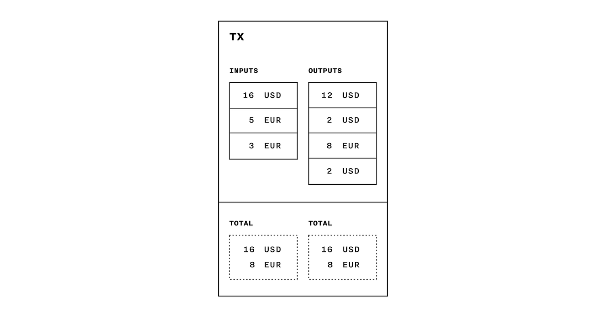
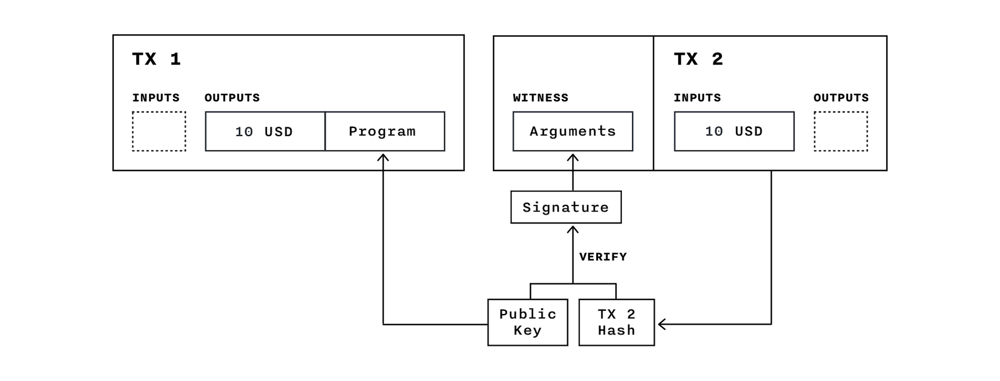
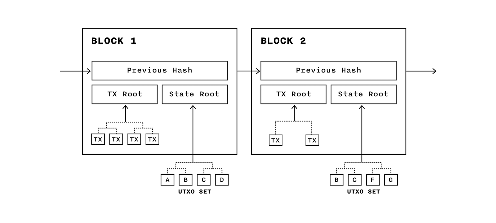

# Chain Protocol Whitepaper

1. [Introduction](#1-introduction)
2. [Motivation](#2-motivation)
3. [Data model](#3-data-model)
4. [Programs](#4-programs)
5. [Consensus](#5-consensus)
6. [Security](#6-security)
7. [Scalability](#7-scalability)
8. [Extensibility](#8-extensibility)
9. [Interoperability](#9-interoperability)
10. [Conclusion](#10-conclusion)

## 1. Introduction

In this paper, we present the Chain Protocol: a design for a shared, multi-asset, cryptographic ledger. It supports the coexistence and interoperability of multiple independent networks, with different operators, sharing a common format and capabilities. Using the principle of least authority, control over assets is separated from control over ledger synchronization.

The Chain Protocol allows any network participant to define and issue assets by writing custom “issuance programs.” Once issued, units of an asset are controlled by “control programs.” These programs are expressed in a flexible and Turing-complete programming language that can be used to build sophisticated smart contracts.

Each network is secured by a federation of “block signers.” The system is secure against forks as long as a quorum of block signers follows the protocol. For efficiency, block creation is delegated to a single “block generator.” Any node on the network can validate blocks and submit transactions to the network.

Chain Core is an enterprise software product that implements the Chain Protocol. An open-source [developer edition](https://github.com/chain/chain) is freely available, and Chain operates a Chain blockchain network as a freely accessible testnet. 

In the [second section](#2-motivation), we explain the background and motivation for the design of the protocol.

Next, we describe key concepts — [assets, transactions, blocks](#3-data-model), [programs](#4-programs) and [consensus protocol](#5-consensus) — and discuss how programmed rules are enforced and double-spending is prevented.

Finally, we discuss various aspects of the blockchain network: [security](#6-security), [scalability](#7-scalability), [extensibility](#8-extensibility) and [interoperability with other networks](#9-interoperability).

## 2. Motivation

In the modern financial system, assets such as currencies, securities, and derivatives are typically held and traded electronically. This miraculous abstraction hides the true complexity of the system: a messy decentralized web of mutual obligations, indirect ownership, and periodic settlement. Transferring assets often requires point-to-point interaction between multiple intermediaries, and reconciliation of duplicated ledgers.

This system has many downsides:

* **Time:** settlement of asset transfers or payments often takes days.
* **Cost:** transfers involve fee payments to multiple intermediaries, and reconciliation has expensive overhead.
* **Transparency:** it may be difficult to find out the status of a pending transfer or the current owner of an asset.
* **Atomicity:** transfers may not complete, and it is difficult to make one transfer conditional on another.
* **Security:** the complexity of the existing system makes it difficult to prevent fraud or theft.
* **Finality:** whether transactions are reversible depends on the transfer mechanism, rather than the business requirements of the transacting party.

Many of these problems could be addressed if asset ownership were recorded on a *single shared ledger*. But a combination of practical and technological constraints have made such ledgers difficult to adopt. Such a shared ledger would tend to require trust in a single party. That party would need to have the technical capacity to process every transaction in real time. Additionally, to support reversible, atomic, or complex transactions, the ledger would need to support more sophisticated logic than simple ownership changes.

In 2009, Satoshi Nakamoto introduced [Bitcoin](https://bitcoin.org/bitcoin.pdf), the first implementation of a protocol that enables issuance of a digital bearer instrument without a trusted third party, using a ledger replication system that has come to be known as a “blockchain.” Bitcoin solves the difficult problem of implementing decentralized digital cash, but its security model limits its efficiency and throughput, its design only supports a single native asset, and its virtual machine has only limited support for custom programs that determine asset movement, sometimes called “smart contracts.”

Ethereum, which launched in 2015, generalizes the concept of a blockchain to a fully programmable state replication mechanism. While it includes a much more powerful programming language, it presents additional challenges for scalability and efficiency. Its general-purpose computation model makes it difficult for engineers to reason about security of their applications.

In contrast to Bitcoin and Ethereum, which are designed to operate on the public Internet (a highly hostile environment), most financial activity already occurs within restricted networks of financial institutions. A shared ledger operated within this network can exhibit the advantages of blockchain technology without sacrificing the efficiency, security, privacy, and flexibility needed by financial institutions.

## 3. Data model

The purpose of a Chain blockchain network is to manage issuance, ownership, and control of digital *assets*. Assets are issued, transferred, and exchanged by posting *transactions* to the network. These transactions are ordered and batched into *blocks*, which together form an immutable *blockchain*.

#### Assets

A single Chain blockchain can support multiple types of assets.

Each type of asset has an asset identifier, or *asset ID*. An asset ID is a 256-bit string designed to be globally unique not only within one blockchain, but across all blockchains.

Each Asset ID corresponds to an *issuance program*, which defines the rules for issuing units of that asset. Once units have been issued, the rules for spending them are determined by *control programs*.

#### Transactions

Transactions move value from *inputs* to *outputs*. Each input specifies a source of value — either an issuance of new units, or an output from a previous transaction. Each output specifies a destination — namely, a control program defining the rules for spending that output in the future.

Each input and output specifies a quantity of a single asset ID. A transaction can mix inputs and outputs of different asset IDs, or merge or split inputs into outputs with different amounts, as long as the total values of the inputs and the total values of the outputs balance.

Each input must satisfy an *issuance program* (if the source of value is a new issuance of units) or a *control program* (if the source of value is a previous unspent transaction output). The issuer or spender may pass *arguments* to the program via the *witness* field. For example, an issuance or control program can implement an authorization check by defining a public key and requiring a cryptographic signature over the transaction by the corresponding private key.

[sidenote]

This “witness” field is not included in the transaction ID, and is therefore not covered by signatures of the transaction, which is why such signatures can themselves be included in the witness. This design is partially inspired by the “segregated witness” proposal, described in [BIP 141](https://github.com/bitcoin/bips/blob/master/bip-0141.mediawiki) by Pieter Wuille et al., which is expected to be adopted by the Bitcoin network by the end of 2016. 

[/sidenote]

Each transaction, and each individual input and output, includes a *reference data* field for arbitrary application-level uses. The Chain Protocol specifies how reference data is committed to the blockchain, but does not mandate any structure or semantics for its contents.

#### Blocks

Once a transaction has spent a particular output, no other transaction is allowed to spend that same output. To prevent such “double-spending”, the network maintains a unique and immutable ordering of all transactions together with a *blockchain state* consisting of *unspent transaction outputs* (UTXOs). Transaction inputs are allowed to reference only unspent outputs from the UTXO set. Once a transaction is applied, the spent outputs are removed from the set and the new outputs are added to it.

A *block* is a data structure that batches multiple transactions to be executed. Each *block header* contains the hash of the previous block, turning the series of blocks into an immutable *blockchain*. 

[sidenote]

A *hash* is the result of running a deterministic one-way hash function on a given input data. A good hash function is collision-resistant: it is infeasible to find two inputs that hash to the same output. This property makes a blockchain immutable, since it is impossible to change a block without changing its hash, and thus changing the hashes in the headers of all subsequent blocks.

[/sidenote]

A block contains the hash of all its transactions and the hash of the current state — i.e., the set of current unspent outputs. This “snapshot” of the blockchain state makes it easy for a network participant to join an ongoing network without having to “replay” the blockchain’s entire history. The hashes are the roots of two *Merkle trees* that enable compact proofs of existence of any given transaction or unspent output, and allow concurrent download and verification of their elements.

To prevent unauthorized participants from creating new blocks, each new block must satisfy a *consensus program*, which is specified in the header of the previous block. The consensus program — much like an issuance or control program — receives  arguments from the new block’s *witness* field.

For example, a consensus program could specify a public key, and require that the next block’s witness contain a signature by the corresponding private key, using the block hash as a message. This is the basis of the consensus programs used in Chain’s [federated consensus protocol](#5-consensus). The flexibility and power of the [programming language](#4-programs), however, means that the protocol could theoretically support arbitrary consensus algorithms — even complex ones based on “proof-of-work” or “proof-of-stake”.

## 4. Programs

Chain Protocol blockchains are designed to be flexible and programmable, supporting custom logic at every level.

* *Issuance programs* specify the rules for issuing new units of an asset.
* *Control programs* specify the rules for spending existing units of an asset.
* *Consensus programs* specify the rules for accepting new blocks.

Programs authenticate the data structure in which they are used. They run deterministically, use capped memory and time requirements, and can be evaluated in parallel.

Programs are flexible enough to allow implementing a wide range of financial instruments (such as options, bonds, and swaps), security schemes (for storing assets), and applications such as offers, escrows, and auctions.

#### Virtual machine

A *program* is written in *bytecode* — instructions for the Chain Virtual Machine (CVM). The CVM is a stack machine: each instruction performs operations on a data stack. 

When validating a program, the CVM initializes the data stack with *program arguments* passed from the witness. The program is then executed, and either succeeds or fails.

The CVM’s instruction set is Turing complete. To prevent unbounded use of computational resources, the protocol allows networks to set a *run limit* that a program is not allowed to exceed. Each instruction consumes some of the limit as it runs, according to its *run cost*.

[sidenote]

Bitcoin, similarly, uses scripts as predicates in order to determine whether a given state transition — encoded in a transaction — is authorized. This is different from Ethereum’s approach, in which programs directly compute the resulting state.

Both Bitcoin and Ethereum have restrictions that prevent script execution from using excessive amounts of time or memory. Chain’s run limit mechanism is similar to Ethereum’s “gas,” except that there is no on-chain accounting for the execution cost of a transaction.

[/sidenote]

The CVM provides a range of data processing instructions, from arithmetic operations to higher-level cryptographic functions such as `SHA3`, `CHECKSIG`, and `CHECKMULTISIG`. It also supports transaction introspection instructions and flexible control-flow operations.

#### Introspection

*Transaction introspection* instructions allow an issuance program or control program to define not only *who* can spend it, but *when* and *how* it can be spent. They do this by allowing the program to access and evaluate fields of the transaction.

The `TXSIGHASH` instruction gets the hash of the current transaction, allowing the program to check that a spender has provided a valid signature.

The `MINTIME` and `MAXTIME` instructions get the respective “mintime” and “maxtime” fields of the transaction, allowing the program to prevent spending or issuance after a given deadline, or before a given release time.

The `CHECKOUTPUT` instruction allows a program to verify that specific amounts of assets are sent to outputs with specific control programs. This, along with introspection instructions that allow access to information about the input being spent (`AMOUNT`, `ASSET`, `PROGRAM`, and `INDEX`), allows developers to implement arbitrary state machines to govern assets.

[sidenote]

The `MINTIME` and `MAXTIME` instructions (and their associated transaction fields) provide functionality similar to Bitcoin’s `CHECKLOCKTIMEVERIFY`.

The `CHECKOUTPUT` instruction provides functionality similar to the `CHECKOUTPUTVERIFY` instruction proposed by Malte Möser, Ittay Eyal, and Emin Gün Sirer in their [Bitcoin Covenants](http://fc16.ifca.ai/bitcoin/papers/MES16.pdf) paper.

[/sidenote]

The protocol also specifies several *block introspection* instructions (`BLOCKHASH`, `NEXTPROGRAM`). These instructions can only be used in consensus programs (since transactions must be capable of being validated independently of the block header).

#### Control flow

Programs can implement conditional branches and loops using the `JUMP` and `JUMPIF` instructions, which allow branching to a statically defined address in the program. The run limit ensures that infinite loops are not possible.

Programs can verify other programs using the `CHECKPREDICATE` instruction, which evaluates an arbitrary byte string as a program with given arguments. 

This instruction permits a generalization of signatures where, instead of signing a specific message (such as a transaction hash), the signer signs a predicate in its byte-string form. The combined signature and predicate is a “signature program” that is considered a valid signature on any message for which the predicate evaluates to true. When combined with the introspection instructions, signature programs allow much greater flexibility in spending a transaction: instead of authorizing a specific transaction by signing its hash, a spender can sign a set of conditions that the transaction must fulfill (which may include having a specific hash). This enables partially signing a transaction before it is completed or balanced.

`CHECKPREDICATE` enables many other powerful features, including “Merkleized programs” (see [MAST by Jeremy Rubin et al](http://www.mit.edu/~jlrubin/public/pdfs/858report.pdf)) that commit to hashes of each branch, but do not require revealing the contents of a branch unless it needs to be executed.

## 5. Consensus

As described above, a consensus program allows the blockchain to implement arbitrary consensus protocols. The first version of the Chain Protocol specifies a default consensus protocol based on approval from a federation of block signers.

[sidenote]

The Chain Protocol’s approach to federated consensus is similar to one described by Nick Szabo in [Secure Property Titles with Owner Authority](http://nakamotoinstitute.org/secure-property-titles/), published in 1998.

[/sidenote]

A consensus program specifies a set of N public keys and uses the `CHECKMULTISIG` and `BLOCKHASH` instructions to confirm that the block witness includes M valid signatures on the block hash (where M and N are parameters of the algorithm).

Each public key corresponds to a block signer. Block signers should never sign two different blocks with the same height. As long as no more than 2M - N - 1 block signers violate this rule, the blockchain cannot be forked.

Because of this rule, block signers must coordinate to make sure they sign the same block. To ensure this, they rely on a single *block generator*. The block generator collects transactions, periodically batching valid ones together into blocks.

The generator sends each proposed new block to the block signers. Block signers only sign blocks that have already been signed by the generator.

While the block generator is not capable of forking the blockchain, it does have a privileged role. The block generator has control over network liveness: if the block generator crashes or otherwise stops producing new blocks, the blockchain halts. The block generator can also deadlock the network by sending inconsistent blocks to different block signers. Additionally, the block generator has control over the block timestamp, and can produce blocks with artificially “slow” timestamps. 

These tradeoffs are considered acceptable based on the current business use cases for the protocol. For most permissioned networks, it makes sense to have a single company or market utility responsible for continued operation of the network. High-availability of the block generator is an engineering problem that can be solved through replication, without the need for Byzantine-fault-tolerant distribution. If the block generator behaves maliciously, or is intentionally shut down, it is probably better (in these use cases) for the network to stop. Such misbehavior can be detected and dealt with out-of-band.

This consensus protocol, therefore, does not attempt to solve the general problem of Byzantine agreement. It requires trust assumptions that are unusually strong relative to Byzantine-fault-tolerant algorithms, but usefully weak relative to centralized databases. In practice, they are reasonable for many real-world deployments. Future versions of the Chain Protocol may specify consensus protocols with weaker assumptions for a broader range of applicability.

## 6. Security

The Chain Protocol is intended to be secure under realistic threat models for specific use cases.

#### Direct asset ownership

Assets are typically controlled by one or more cryptographic keys. The Chain Protocol supports M-of-N *multisignature* control programs and issuance programs that help reducing the risk of theft by tolerating compromise of up to M–1 cryptographic keys. The protocol uses highly secure Ed25519 keys, which are increasingly being adopted as an industry standard. Private keys can be generated and stored in hardware security modules (HSMs), making key compromise much more difficult. HSM integration is included as a feature in [Chain Core Enterprise Edition](https://chain.com/enterprise).

#### Privacy

Traditional ledgers achieve a level of privacy by limiting information access to the parties involved and a trusted third party. By contrast, the requirement of a blockchain system to announce all transactions to all network participants precludes this method. Privacy can still be maintained, however, by breaking the flow of information in another place: keeping public keys pseudonymous. The network can see that a transaction occurred, but uninvolved parties lack the information to link the transaction with specific identities.

Chain’s implementation of the Chain Protocol, Chain Core, uses unique public keys for each control program to prevent observers from linking multiple outputs to one account. Individual keys are derived from a single master key to make key management safer. Chain Core implements a [key derivation scheme](../specifications/chainkd.md) that allows public and private keys to be derived from the common master key pair independently, therefore permitting creation of unique public keys without access to the master private key.

Programs that facilitate multi-party contracts may depend on sensitive data such as deadlines, prices, and interest rates. These can be hidden via Merkleized programs (see [MAST](http://www.mit.edu/~jlrubin/public/pdfs/858report.pdf)) that contain only hashes of each branch, for which only the executed branches need to be revealed during execution. Such a smart contract could allow spending in one of two ways: by providing signatures from all parties on the new transaction (allowing parties to agree to how a contract should be resolved, while preserving privacy), or by revealing and executing the private smart contract code. This is similar to how contracts work in the real world — while enforcement in court typically requires the terms of the contract to be made public, most contracts are settled in private, with the public system only necessary as an implicit backstop.

The Chain Protocol can also be extended with additional confidentiality features, as covered in [Blockchain Extensibility](blockchain-extensibility.md).

#### Consensus security

Security against forks — i.e., security against history-editing or double-spending — is enforced by the consensus protocol.

The consensus protocol guarantees safety — i.e, the blockchain cannot be “forked” to show two different versions of history — as long as at least 2M – N – 1 block signers obey the protocol. The protocol guarantees liveness as long as the block generator and at least M block signers follow the protocol.

If signers attempt to fork the blockchain, this behavior can be detected and proven to an observer. Finally, any party that monitors the block headers can detect history-editing when it occurs.

The set of participants and the number of required block signatures can be configured differently for each blockchain network to provide different tradeoffs between liveness, efficiency, and safety. Within a network, those parameters can change over time (with the approval of a quorum of block signers ) as the needs of the network evolve.

#### Local policy

Block generators can implement local policies that filter out non-compliant transactions. This allows implementation of business or regulatory requirements (such as KYC/AML rules) that are outside the scope of the protocol. Local policies can be changed freely over time, as they are not enforced and verified by the rest of the network nodes.

#### Compact proofs

The block header includes the Merkle root of the transactions in the block as well as the current UTXO state, which allows compact *Merkle proofs* about a given part of the blockchain, such as whether a transaction has been accepted, or whether a particular UTXO remains unspent. Merkle proofs link a piece of data to a block header, from which a participant can check the timestamp and the block signers’ signatures. 

As a result, entities can participate in the network without seeing any transactions other than the ones in which they are involved. They only need to validate block headers, along with compact proofs of the relevant transactions and/or UTXOs.

Compact proofs can also protect network participants against misbehaving block signers. If a block signer signs multiple blocks at the same height, participants can use the inconsistent signatures to construct *fraud proofs* to warn other nodes or provide evidence for enforcement out-of-band.

## 7. Scalability

The Chain Protocol makes several design decisions to support scalable transaction processing.

First, the UTXO model makes it possible to verify transactions in parallel — potentially on separate servers. This makes scaling easier, compared to a “programmable state-machine” model, such as Ethereum’s, which requires each transaction to be executed in sequence. Programs do not calculate or alter state — rather, each transaction fully specifies a state transition, and each program checks whether the specified state transition is valid. As a result, the program for each input can be validated independently. Similarly, each transaction in a block can be validated in parallel (except that UTXOs must be created before they are spent, and each UTXO can be spent only once).

Second, the protocol does not require that participants keep track of the entire blockchain state. Participants only need to remember the hashes of unspent outputs, since transactions include the details (such as asset ID, amount, and control program), which can be verified against the hash. This trades bandwidth for memory, making it easier for participants to avoid costly disk accesses.

Finally, compact proofs allow users to validate only the parts of the blockchain with which they are concerned without processing and validating all transactions, as long as they trust a quorum of block signers. An example of such proof is a Merkle path that proves that a given transaction or unspent output is included in a particular block. For additional security, clients could delegate the task of monitoring the entire blockchain to a server they trust.

## 8. Extensibility

The Chain Protocol is extensible to allow fixing bugs and adding new security features while keeping all network nodes compatible with the blockchain. Changes can be applied using a “soft fork” method that preserves both backward and forward compatibility, allowing outdated clients to continue validating the blockchain. 

Blocks, assets, transactions, and programs each have version numbers and extensible fields. New versions can fix security flaws or add features — such as adding an instruction to the VM, changing the VM completely, or introducing an entirely new accounting system and a new category of assets.

If a client does not recognize a version number for a field in a block or transaction, it treats it as “unknown” and assumes that it is valid. This allows outdated clients to continue validating the parts of the blockchain that use old rules while ignoring the parts using new rules, deferring to block signers for their validation. Some participants may choose to stop performing sensitive operations — such as signing transactions or accepting payments — if they detect an unknown version number and wish to upgrade the software before continuing operation.

## 9. Interoperability

The Chain Protocol can power multiple blockchain networks simultaneously. While these networks use the same protocol, their asset IDs are anchored to the initial blocks of these networks, making them globally unique.

Cross-ledger interaction is possible using cross-chain swap protocols, such as [Interledger](https://interledger.org/interledger.pdf). For example, the CVM is capable of supporting the SHA-256, PREIMAGE, PREFIX, THRESHOLD, and ED25519 feature suites of [Crypto-Conditions](https://github.com/interledger/rfcs/blob/master/0002-crypto-conditions/0002-crypto-conditions.md). These protocols allow participants on different Chain blockchains to interact with each other, as well as with participants on different types of blockchains and ledgers.

The Chain Protocol uses standard cryptographic tools such as SHA-2 and SHA-3 hash functions and the secure signature algorithm Ed25519.

## 10. Conclusion

This paper has presented the Chain Protocol: a design for a shared, multi-asset, cryptographic ledger that can underpin modern financial networks. The protocol is designed for large scale applications, offering a scalable and extensible data model with a flexible yet robust programming environment.

The Chain Protocol allows participants to issue and control assets programmatically using digital signatures and custom rules. Transactions issuing and controlling assets are collected into a cryptographic chain of blocks forming a shared ledger. Block signers follow a [federated consensus protocol](#5-consensus) to replicate a single copy of the ledger across all nodes to prevent reversal of transactions and double-spending. 

Chain Core is software that implements the Chain Protocol. Using Chain Core, organizations can launch a blockchain network in their market or connect to a growing list of networks that are enabling this new medium for assets – one that reduces the time, cost, and complexity of asset transfer and custody in the financial system and can give rise to new products and services that are difficult or impossible to realize on traditional infrastructure.

## Further reading

* [Federated Consensus](federated-consensus.md)
* [Blockchain Programs](blockchain-programs.md)
* [Blockchain Extensibility](blockchain-extensibility.md)
* [Blockchain Data Model Specification](../specifications/blockchain.md)
* [Virtual Machine Specification](../specifications/vm1.md)
* [Key Derivation Specification](../specifications/chainkd.md)
* [Chain Core Documentation](../../)

